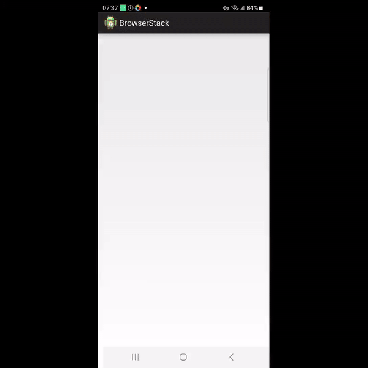
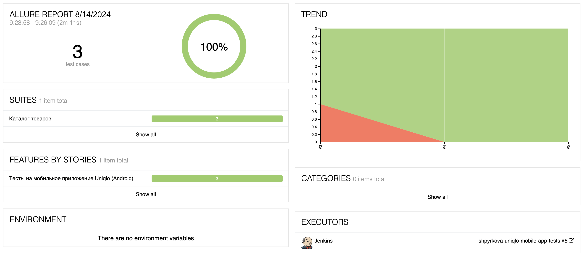
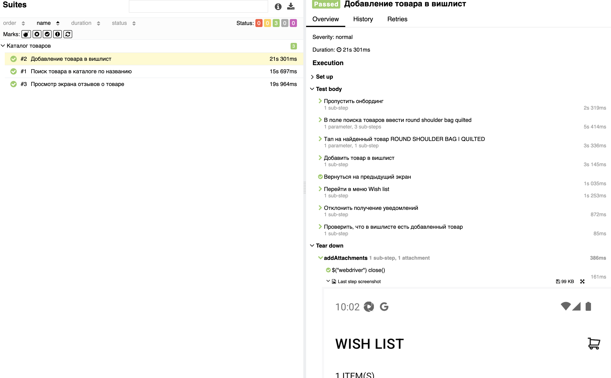
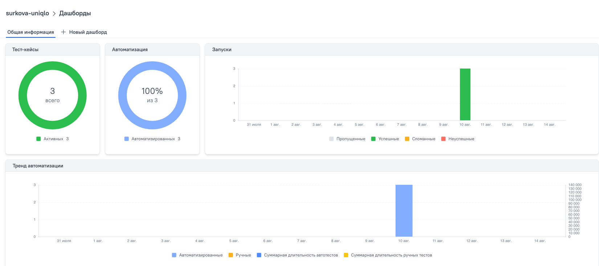
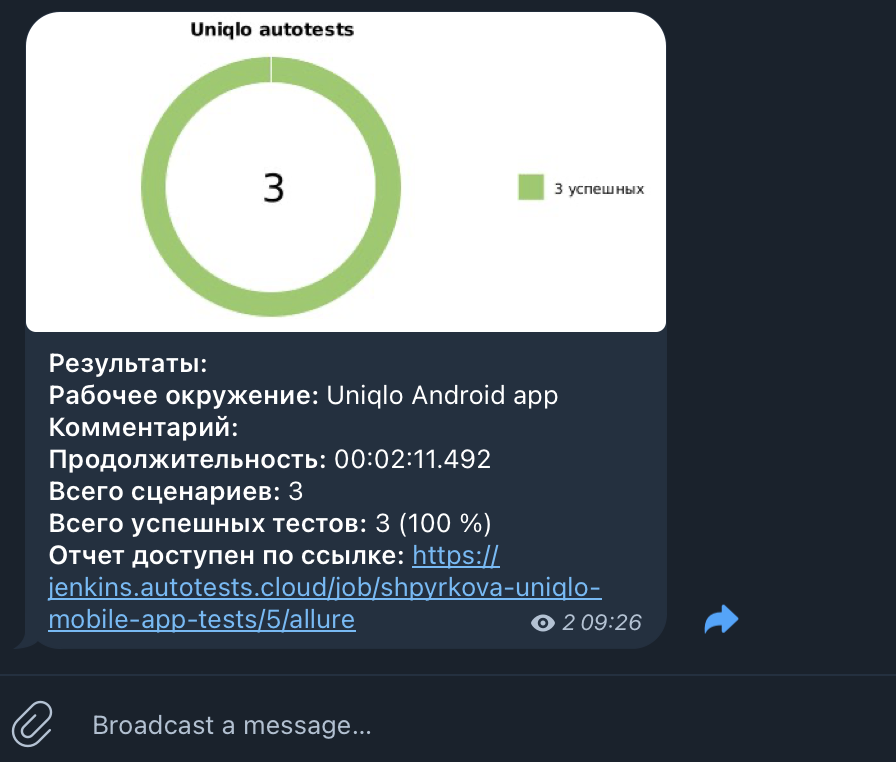

## Содержание
+ [Описание проекта](#Описание-проекта)
+ [Технологии и инструменты](#Технологии-и-инструменты)
+ [Реализованные проверки](#Реализованные-проверки)
+ [Запуск тестов](#Запуск-тестов)
  + Запуск из Jenkins
  + Локальный запуск
+ [Пример выполнения WEB теста в Browserstack](#Пример-выполнения-теста-в-Browserstack)
+ [Интеграция с Allure Report](#Интеграция-с-Allure-report)
+ [Интеграция с Allure TestOps](#Интеграция-с-Allure-TestOps)
+ [Уведомления в Telegram с использованием бота](#Уведомления-в-Telegram-с-использованием-бота)

## Описание проекта
В проекте реализованы автотесты на мобильное приложение Uniqlo для Android.

**Особенности проекта**:
- Возможность запуска тестов: локально (на эмуляторе или реальном устройстве), удаленно на Browserstack.
- Возможность запуска тестов напрямую из Allure TestOps
- Уведомление о результатах прохождения в Telegram
- По результатам прохождения автотестов генерируется Allure отчет. Содержание отчета:
    - Шаги теста
    - Скриншот экрана на последнем шаге
    - Видео выполнения автотеста (при запуске из Browserstack)

## Технологии и инструменты

<div align="center">
<a href="https://www.jetbrains.com/idea/"></a>
<a href="https://github.com/"></a>  
<a href="https://www.java.com/"></a>
<a href="https://gradle.org/"></a>  
<a href="https://junit.org/junit5/"></a>
<a href="https://selenide.org/"></a>
<a href="https://appium.io/"></a>
<a href="https://developer.android.com/studio"></a>
<a href="https://www.browserstack.com/"></a>
<a href="https://www.jenkins.io/"></a>
<a href="https://github.com/allure-framework/"></a>
<a href="https://qameta.io/"></a>
<a href="https://telegram.org/"></a>
</div>

## Реализованные проверки
- [x] Поиск продукта в каталоге по названию
- [x] Добавление продукта в вишлист
- [x] Просмотр экрана отзывов о товаре

# Запуск тестов
## Запуск из Jenkins 

Тесты по умолчанию запускаются в Browserstack командой запуска без параметров:
```shell
gradle test 
```
Эта команда используется для запуска билда в Jenkins.</br>

Для запуска тестов на Browserstack используется демо-учетка Browserstack, которая имеет ограничение на суммарное время запусков. По истечении времени необходимо обновить учетную запись.</br>
## Локальный запуск 
По умолчанию через кнопку в InteliJ IDEA тесты запускаются удаленно в Browserstack.<br>
Для этого дополнительно настраивать локальные устройства и Appium server не нужно.

Для запуска тестов на локальных устройствах потребуется:
1. Запустить Appium Server и устройство, на котором будут выполняться тесты.
2. Обновить параметры устройства в файлах <code>resources/real.properties</code> или <code>resources/emulation.properties</code>.

Для запуска тестов локально на реальном девайсе запустить команду:
```shell
gradle test -Denv=real
```
***
Для запуска тестов локально на эмуляторе запустить команду:
```shell
gradle test -Denv=emulation
```
#### Построение Allure отчета после локального запуска

Команда для открытия отчета в браузере:
```
gradle allureServe
```
## Пример выполнения теста в Browserstack

> К результатам прогонов тестов, запущенных на Browserstack, прикладывается видео выполнения теста.
<p align="center">
   
</p>

# Интеграция с Allure report
Ссылка доступна только с авторизацией: <b><a target="_blank" href="https://jenkins.autotests.cloud/job/shpyrkova-uniqlo-mobile-app-tests/6/allure/">Allure report</a></b>
 

### Развернутый результат прохождения теста:


## Интеграция с Allure TestOps
Ссылка доступна только с авторизацией: <b><a target="_blank" href="https://allure.autotests.cloud/project/4368/dashboards">Allure TestOps</a></b>

>Диаграммы прохождения тестов
>


## Уведомления в Telegram с использованием бота

> В Telegram создан канал, куда отправляются результаты прогона тестов в Jenkins. Бот после завершения прогона отправляет сообщение с отчетом о статусе прогона.<br>
> Для уведомлений в Telegram используется библиотека <b><a target="_blank" href="https://github.com/qa-guru/allure-notifications">allure-notifications</a></b>. JAR библиотеки лежит в Jenkins.
>
